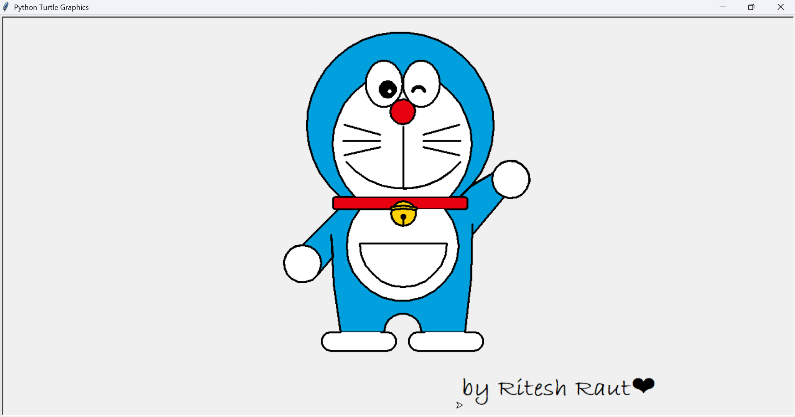

**# Doraemon Drawing with Sketchpy 🤖🎨**

---

## Project Description 📝

This project uses the `sketchpy` library in Python to programmatically create a line drawing of Doraemon. The script automates the drawing process, resulting in a cool piece of art generated by code.

---

## 📁 Project Structure

doreamon_python/
│
├── doreamon_python_draw/       # Subfolder containing drawing-related files
│   ├── index.py                # Main Python script for drawing or logic
│   └── pythonoutput.png        # Output image generated by the Python script
│
└── README.md                   # Project overview and instructions

---

## Output 🖼️

After running the script, a window will appear and you will see the drawing of Doraemon being created line by line.

Once the script is finished, your Doraemon Drawing is ready! 🎉



---

## How to Run 🚀

Follow these steps to generate the Doraemon drawing on your machine.

---

### Prerequisites 🐍

Make sure you have Python installed (version 3.8 or newer is recommended).

---

### Installation and Execution

1.  **Install pip (if needed):** If you don't have `pip` (the Python package installer), run the `get-pip.py` script.
    ```bash
    python get-pip.py
    ```
2.  **Install Dependencies:** Use pip to install the necessary library from the `requirements.txt` file.
    ```bash
    pip install -r requirements.txt
    ```
3.  **Run the main script:** Execute `index.py` to start the drawing.
    ```bash
    python index.py
    ```
---

## 👤 Author

**Ritesh Raut**  
*Programmer Analyst, Cognizant*

🤖 Draw Your Favorite Gadget Cat — Code Your Own Doraemon with Python! 🎨⚡

---

### 🌐 Connect with me:
<p align="left">
<a href="https://github.com/Riteshraut0116" target="blank"></a>
<a href="https://linkedin.com/in/ritesh-raut-9aa4b71ba" target="blank"></a>
<a href="https://www.instagram.com/riteshraut1601/" target="blank"></a>
<a href="https://www.facebook.com/ritesh.raut.649321/" target="blank"></a>
</p>

---